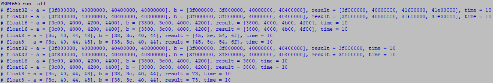
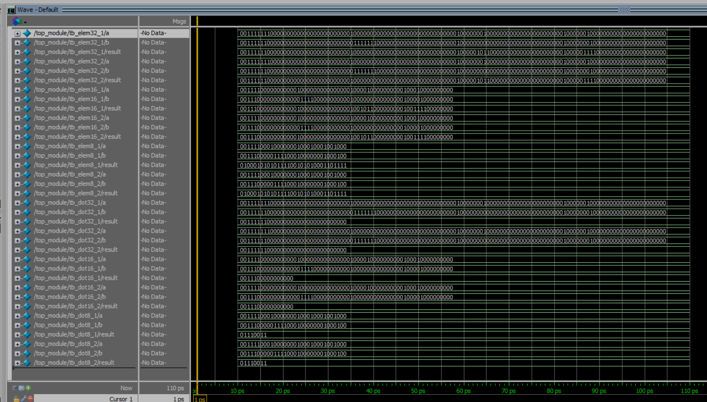

# NettverkProsjekt

This repository contains the code and resources used for a demonstration in ModelSim - FPGA in the course IDATT2104 Network Programming.

## Task Description

The theme of this voluntary project is parallelization and better energy utilization of algorithms such as element-wise multiplication and dot product of potentially very many vectors with a given number of elements.

The objective is to create a video lecture on Field-programmable gate array (FPGA) and/or Application-specific integrated circuit (ASIC). The lecture should be between 30 and 45 minutes long and cover the following topics:

- What are FPGA and/or ASIC?
- How do FPGA and/or ASIC differ from CPU and GPU?
- General use cases of FPGA and/or ASIC
- Specific usage examples with FPGA and/or ASIC, preferably citing scientific articles
- Limitations of FPGA and/or ASIC

Additionally, the lecture may include:
- Various ways to program FPGA and/or ASIC with practical code examples and a link to the code repository
- How to implement element-wise multiplication and dot product in FPGA and/or ASIC
- How to perform multiple such operations in parallel
- Utilizing different floating-point types such as float8, float16, and/or float32 in FPGA and/or ASIC

## Code Overview

### Verilog Modules

#### Element-wise Multiplication Module

This module performs element-wise multiplication of floating-point numbers. The data width can be adjusted to support different floating-point formats such as float32, float16, and float8.

#### Dot Product Module

This module calculates the dot product of floating-point numbers. Similar to the element-wise multiplication module, it supports different data widths.

### Testbenches

#### Testbench for Element-wise Multiplication

This testbench verifies the element-wise multiplication module using vectors of various floating-point formats.

#### Testbench for Dot Product

This testbench verifies the dot product module using vectors of various floating-point formats.

### Top-level Module

The top-level module instantiates and runs multiple simulations in parallel to verify the functionality of both element-wise multiplication and dot product modules.

### C Code for Comparison

To compare the performance of the FPGA implementation with a CPU implementation, we also provide C code that performs element-wise multiplication and dot product of vectors.

## Simulation Results

### ModelSim Simulation

The provided screenshots show the simulation results for various test cases. The results include the time taken for each operation, demonstrating the efficiency of the FPGA implementation.

#### Results for Element-wise Multiplication and Dot Product

- **Element-wise Multiplication Time per iteration:** 5.000000e-09 seconds
- **Dot Product Time per iteration:** 4.000000e-09 seconds

## Contributors

- [@sanderskofsrud](https://www.github.com/sanderskofsrud)
- [@vegardjohnsen](https://github.com/VegardJohnsen)
- [@eriktur](https://github.com/eriktur)
